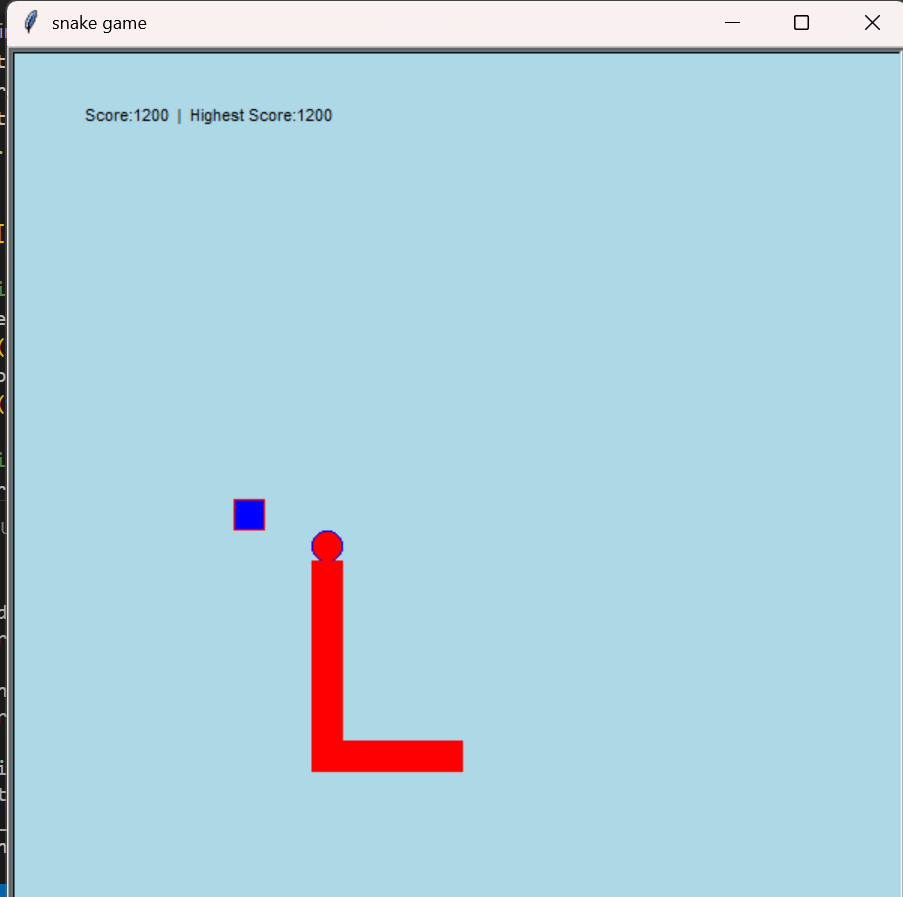

 🐍 Snake Game in Python  

This is a **classic Snake Game** built using Python's `turtle` module.  
The game is simple, fun, and interactive – move the snake using arrow keys, eat food, and try to score the highest!  

---

## 🎮 Features
- Snake movement with keyboard (Up, Down, Left, Right)  
- Random food generation at different positions  
- Snake body grows every time it eats food  
- Score tracking with Highest Score memory  
- Collision detection with body & reset mechanism  
- Increasing speed as the score grows  

---

## 🚀 How to Run
1. Make sure you have **Python 3.x** installed.  
2. Clone this repository:  
   ```bash
   git clone https://github.com/YourUsername/snake-game.git
   cd snake-game


